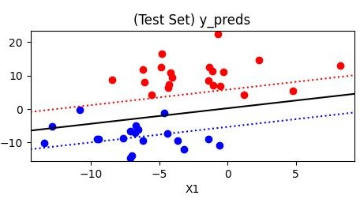
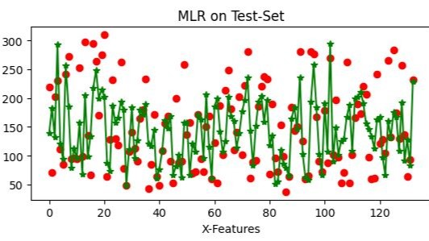
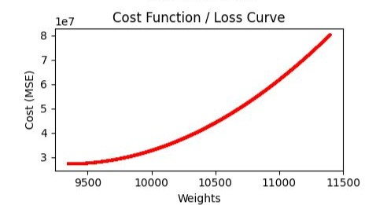
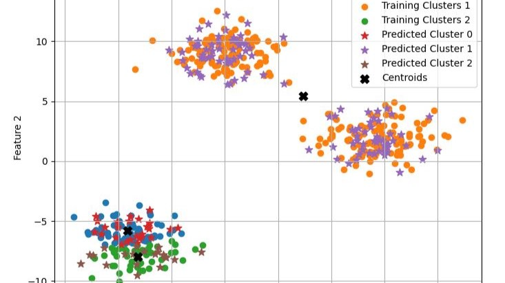

<div style="display: flex; justify-content: space-around; align-items: center;">
  
  
<!--    -->
<!--    -->
</div>

## 📜 machine-learning-algorithms-scratch
Comprehensive Machine Learning concepts &amp; algorithms implemented from scratch using Python &amp; numpy only.

#### 🎯 Use Cases 
- Implementing ML models from sccratch
- Learning the foundation of ML algorithms
  
#### Project Status
- Current Version: V1.0

### 📃 Repository Structure
```
machine-learning-algorithms-scratch/
├── images/
├── datasets/
│   ├── various datasets
│   └── in (.csv/.json/.xlsx) format files
├── supervised/
│   ├── classification
│   │   ├── decision-tree
│   │   ├── knn
│   │   ├── logistic-regression
│   │   ├── naive-bayes
│   │   ├── random-forest
│   │   └── svm
│   └── regression/
│   │   ├── decision-tree
│   │   ├── linear-regression
│   │   └── random-forest
├── unsupervised/
│   │   ├── clustering
│   │   │   ├── kmc
│   │   ├── dimentionality-reduction
│   │   │   ├── pca
│   │   │   └── lda
│   │   ├── association-rule-learning
│   │   └── anomaly-detection
├── semi-supervised
├── README
└── .gitignore                  # gitignore file
```

### ✨ Features
- All ML algorithms convering supervised, unsupervised and semi-supervised learning
- Algorithms/Models implemented completely from scratch using only python & numpy

<!-- ### 🔍 Demo
<a href="https://youtu.be/Qor8kjsCJkA?si=7d1Mhc0KW4GQb3sF" target="_blank">
  
</a> -->

### 🚀 Getting Started
- Knowledge Required : python, linear algebra, probability, statistics, numpy, matplotlib

<!-- ### 🛠️ Hardware Requirements
- None
-->

### 💻 Software Requirements
- IDE (VS Code)
- Python 3
  
### 🛡️ Tech Stack
- Python 💻
- Numpy, Pandas, Matplotlib, Scikit-Learn🧩

<!--
### 🖇️ Schematic
- none
-->

### ⚙️ Installation
```
git clone https://github.com/pointer2Alvee/embd-sys-ultrasonic-radar.git
cd your-repo  
```

### 📖 Usage
- Open the repoitory in vs code
- Run each .ipynb files

### 🗺️ Roadmap
- [x] Raw ML algorithms
- [ ] ML algorithms implementation using tensorflow
- [ ] ML algorithms implementation using scikit-learn
- [ ] ML algorithms implementation using pyTorch

### 🤝 Contributing
Contributions are welcomed!

+ Fork the repo. 
+ Create a branch: ```git checkout -b feature/YourFeature```
+ Commit changes: ```git commit -m 'Add some feature'```
+ Push to branch: ```git push origin feature/YourFeature```
+ Open a Pull Request.

### 📜License
Distributed under the MIT License. See LICENSE.txt for more information.

### 🙏Acknowledgements
- Special thanks to the open-source community / youtube for tools and resources.


